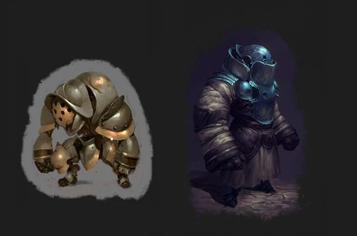

# White Undead

&nbsp;&nbsp;&nbsp;&nbsp;***Monastics.*** 
Undead given life by the white 
necromantic powers designed by Sehanine Moonbow. 
While many types of undead are known to be granted
life by this type of necromancy, monastics are 
defined by their possesion of once inanimate 
objects.

&nbsp;&nbsp;&nbsp;&nbsp;***Trudectors.*** 
Often referred to as simply as constructors, those who craft golems to be used in white necromancy are 
given the title of Trudector. As followers of 
Sehanine Moonbow, they dedicate their lives in the pursuit
of crafting the perfect golem, and granting vessels
to the Souls of the Saved to aid in the absolution of
their souls.

 

## **Lesser Brass Monastic**
<h5>

Small undead, chaotic good

</h5>  

---
**Armor Class** 17 (natural armor)  
**Hit Points** 60 (8d8 + 24)  
**Speed** 25 ft.

---
| STR     | DEX     | CON     | INT     | WIS     | CHA     |  
|:-------:|:-------:|:-------:|:-------:|:-------:|:-------:|
| 12 (+1) | 10 (+0) | 14 (+2) | 10 (+0) | 10 (+0) | 10 (+0) |

---
**Damage Resistances** bludgeoning, piercing, and slashing
from nonmagical attacks that aren't adamantine  
**Damage Immunities** divine, poison  
**Condition Immunities** exhaustion, paralyzed, petrified,
poisoned  
**Senses** darkvision 60 ft.  
**Languages** understands all languages it knew in life
but can't speak  
**Challenge** 4 (1,100 XP)

---
***Aversion to Black Necromancy.*** If the monastic takes
black necromantic damage, it has disadvantage on attack
rolls and ability checks until the end of its next turn.

***Divine Absorption.*** Whenever the monastic is subjected
to divine damage, it takes no damage and instead regains
a number of hit points equal to the divine damage dealt.

***Magic Resistance.*** The monastic has 
advantage on saving throws against spells and other 
magical effects.

***Remnants of the Past.*** The monastic's time amongst the 
living affects it's capabilities in undeath. 
See *Determining Monastic Skills & Ability Scores* below.

***Telepathic Bond***. The monastic and it's creator can communicate telepathically.

***Willing Soul***. The monastic retains the knowledge
it has from it's time in life, death, and undeath.

### Actions

---
***Multiattack.*** The monastic makes two slam attacks.

***Slam.*** *Melee Weapon Attack:* +6 to hit, reach 5 ft., 
one target.  
*Hit:* 8 (1d8 + 4) bludgeoning damage.

A **lesser monastic**, generally, is a golem crafted by a novice 
trudector that has been imbued with an undead spirit
by a white necromantic Create Undead spell.

### **Determining Monastic Skills & Ability Scores**

The creatures that make up the Souls of the Saved are as varied
and unique as any group. As such, the capabilites of the
monastic will vary depending on the particular soul that is
bound to it.

&nbsp;&nbsp;&nbsp;&nbsp;***Apt Aptitude.***
The power of the white necromancy involved, along with the fighting style inherent in the design of
a monastic determines the general skill set and level
that is looked for in the souls that are sent to be bound 
to them. Lesser monastics lend themselves more to a physical 
skill set due to their simple construction and lack of 
any spell casting ability. This will be reflected when 
determining ability scores.

&nbsp;&nbsp;&nbsp;&nbsp;***Animated Veterans.*** Outside of druids, finding someone skilled in controlling a 
body outside of their own while alive is rare. As such, most of the souls that find their way to the Moongate
in the afterlife have to practice doing so. Being called to fulfill the request of an Animate Dead spell is where
the vast majority of the Souls of the Saved find their first experience in operating a new form. The limited
power inherent in an Animate Dead spell confines those souls fulfilling it to only mastering the very basics, however
once a soul does so they can then be called to fulfill the requests of more powerful white necromancy, such 
as with Create Undead.

**Determine Ability Scores**

---

Roll 4d6k3 as you would when creating a character until the

* Ability score sum is `>= 77`.
* Sum of the top 2 scores is `>= 32`.

Roll a d20 for each of the following tables to determine the allocation of the top 2 ability scores. 

**Highest Ability Score**

| d20 Result | Abilty Score | 
| :--------: | :----------: |
| 1 - 10     | Dexterity    |
| 11 - 20    | Strength     |

**2nd Highest Ability Score**

| d20 Result | Abilty Score | 
| :--------: | :----------: |
| 1          | Random Mental|
| 2 - 20     | Constitution |

The remaining ability scores are allocated at random with the monastic's strength and constitution not able
to be lower than the base values. The lowest four abilty scores must be less than or equal 
to 14, 12, 9, and 8, regardless of the random value.  

For example, if you got the scores 18, 16, 16, 14, 12, 10, 
and you ended up with a DEX of 18 and WIS of 16, then your INT, CHA, and STR must be the 3 lowest scores since 
a monastic's base constitution is 14. Even though the four lowest random values you got were 16, 14, 12, and 10, 
these scores are capped to 14, 12, 9, and 8. Since the base STR for a monastic is 12, you must distribute the 9 and 8 to INT and CHA.

It is possible for a soul to be fulfilling a Create Undead spell for the first time. While they did master 
operating a skeleton or zombie via the Animate Dead spell, mastering a lesser monastic is much more challenging.
Depending on how new the souls are there capabilities in the new body will need some practice. These souls are 
given blessings to aid the transition.

Roll a percentile dice, if the result is a 1, the monastic is affected by the following:

&nbsp;&nbsp;&nbsp;&nbsp;***Rusty.*** The monastic's dexterity ability score is decreased by 2, to a minimum of 1. The monastic has 
three luck points, to be used as if it had the Lucky feat.

**Determine Skills**

---

The monastic has proficiency in one skill or tool and one subset of weapons. The tool or skill can be chosen at random by the DM, or
one can be chosen to fit the background of the monastic.

All souls that can be chosen to be bound to a lesser monastic will be proficient with simple weapons and shields, however 
the martial weapons they're proficient with are limited to the weapons that they were most familiar with in life.
The monastic may use its multiattack action when attacking with a weapon with which they are proficient.

Roll a d20 for each of the following tables to determine the monastic's weapon proficiencies. 

### **Melee**

| Result | Weapon | 
| :----: | :----: |
| 1 -2   | Axe, 1h |
| 3 - 4  | Axe, 2h |
| 5 - 6  | Mace, 1h |
| 7 - 8  | Mace, 2h |
| 9 - 10 | Spear, 1h |
| 11 - 12 | Spear, 2h |
| 13 - 18 | Sword, 1h |
| 19 - 20 | Sword, 2h |

### **Ranged**

| Result | Weapon | 
| :----: | :----: |
| 1      | Net    |
| 2 - 4  | Hand Crossbow |
| 5 - 12 | Heavy Crossbow |
| 13 - 20 | Longbow |